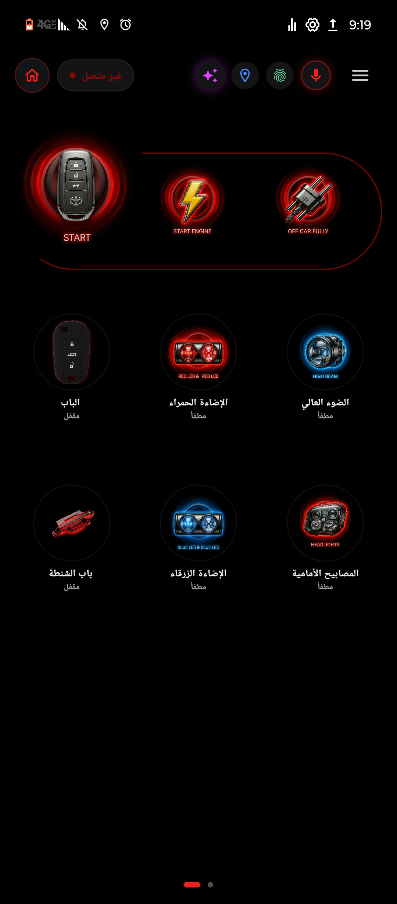
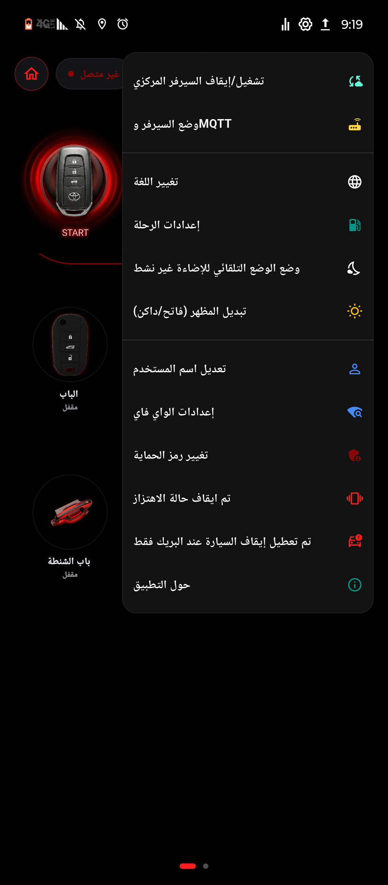
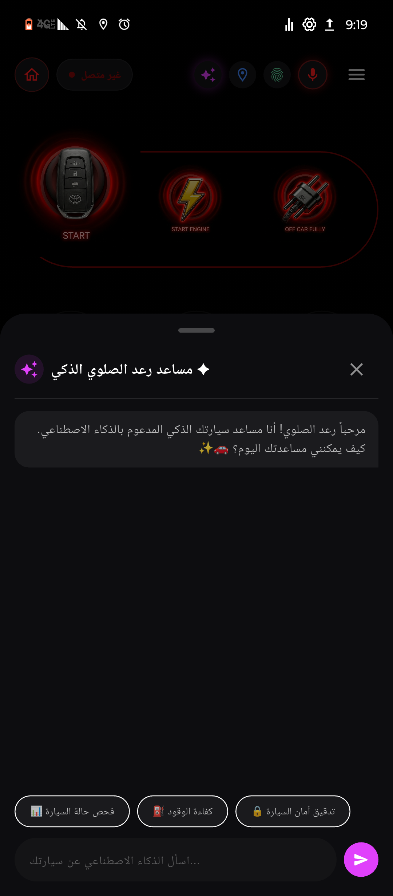
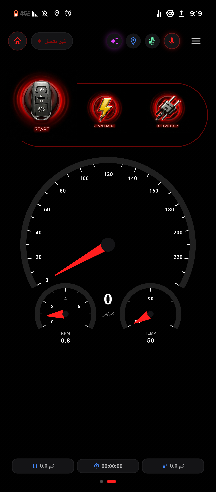
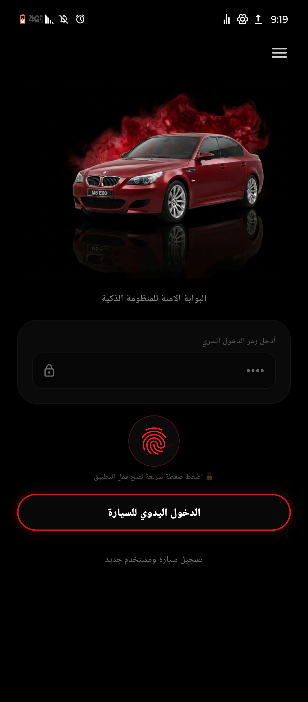

#  Ultimate Smart Car Telemetry & Control System
# نظام التحكم الذكي للسيارات والقيادة المدمجة عن بعد

  <b> A Professional IoT Mobile & Desktop Control System Built for ESP32, Node-RED & Flutter </b>
   
  <b>نظام إنترنت أشياء متطور للتحكم عن بعد بالسيارة عبر ESP32، MQTT، والذكاء الاصطناعي</b>

<!-- Shields Badges -->

  
  
  
  
  

  
  
  
  

---

##  واجهات النظام (System Dashboards & UI)

  
  &nbsp;&nbsp;
  
  &nbsp;&nbsp;
  

  
  &nbsp;&nbsp;
  

---

##  نبذة عن المشروع (About The Project)

**Ultimate Smart Car Telemetry & Control System** هو نظام إنترنت أشياء متكامل مصمم للربط المباشر بين التطبيق والسيارة (Toyota Corolla) عبر متحكم **ESP32**. يتيح النظام مراقبة وتعديل حالة السيارة بالكامل لحظياً (Real-time telemetry)، بدءاً من تشغيل المحرك عن بعد، التحكم بالإضاءة والأبواب، مراقبة السرعة والحرارة (RPM & Temp)، وصولاً إلى مساعد ذكي مدمج (مساعد رعد الصلوي الذكي) للتفاعل الصوتي والنصي مع منظومة السيارة عبر بروتوكولات **MQTT** و **Wi-Fi**.

---

## ✨ المميزات والخصائص الرئيسية (Key Features)

1. **بوابة الأمان والتحقق المتقدم:** حماية النظام عبر رمز السر (PIN Code) أو بصمة الإصبع مع واجهة دخول فاخرة تحاكي أحدث أنظمة السيارات الرياضية.
2. **لوحة العدادات الحية (Live Telemetry):** عرض سرعة السيارة، عدد لفات المحرك (RPM)، درجة الحرارة، ومستوى الوقود بتصميم دائري عصري (Dark Glassmorphism).
3. **التحكم الكامل عن بعد:** إمكانية تشغيل وإطفاء المحرك، قفل وفتح الأبواب وباب الشنطة، والتحكم بالأضواء الأمامية والإضاءة المحيطية (حمراء وزرقاء).
4. **المساعد الذكي للسيارة (AI Assistant):** مساعد مدمج للإجابة على حالة السيارة، فحص الأعطال، وتدقيق الأمان بصوت ونصوص تفاعلية.
5. **الربط السحابي والمحلي (MQTT & Node-RED):** دعم التبديل السريع بين وضع السيرفر المركزي واتصال الـ MQTT لضمان استقرار الإرسال والاستقبال مع شريحة ESP32.

---

## 🛠️ المكونات التقنية وتقنيات الربط (Tech Stack & Architecture)

* **المتحكم الدقيق (Microcontroller):** ESP32 NodeMCU / ESP32-WROOM مع وحدة Wi-Fi مدمجة.
* **بروتوكول الاتصال:** MQTT Broker (HiveMQ / Local Broker) & WebSockets.
* **البرمجيات الوسيطة (Middleware):** Node-RED Dashboard 2.0 لإدارة التدفقات وقراءات المستشعرات.
* **تطبيق الواجهة (UI/UX):** تطوير عبر Flutter بتصميم Dark Glassmorphism مستوحى من أحدث منصات السيارات.
* **التنبيهات:** تكامل مع بوت التليجرام (Telegram Bot) لإرسال تنبيهات الطوارئ والسرقة وحالة المحرك.

---

## 📂 هيكلية ملفات المشروع (Project Directory Structure)

يحتوي المستودع على المجلدات والملفات الأساسية التالية الخاصة بمشروع Flutter:
* `lib/` : يحتوي على الشيفرات البرمجية لتطبيق الـ Flutter وتصاميم الواجهات.
* `assets/` : الموارد والأصول المستخدمة في التطبيق.
* `android/`, `ios/`, `windows/`, `linux/`, `macos/`, `web/` : مجلدات الدعم الخاصة بالمنصات المختلفة.
* `pubspec.yaml` : ملف إعدادات الحزم والاعتماديات الخاصة بالمشروع.

## 👨‍💻 المطور وحسابات التواصل (Developer & Contact)
تم تطوير وتصميم هذه المنظومة بواسطة المهندس رعد فهد عبده قائد الصلوي (Raad Al-Selwi):
* 🐙 GitHub: @rdalselwi
* 💼 LinkedIn: Raad Al-Selwi
* ✈️ Telegram: @r1h_x
* 📧 Email: r.dalselwi@gmail.com
## 📄 حقوق النشر والترخيص (License & Copyright)
جميع الحقوق محفوظة © 2026 المهندس رعد فهد عبده قائد الصلوي (Raad Al-Selwi).

All rights reserved © 2026 Raad Al-Selwi.
