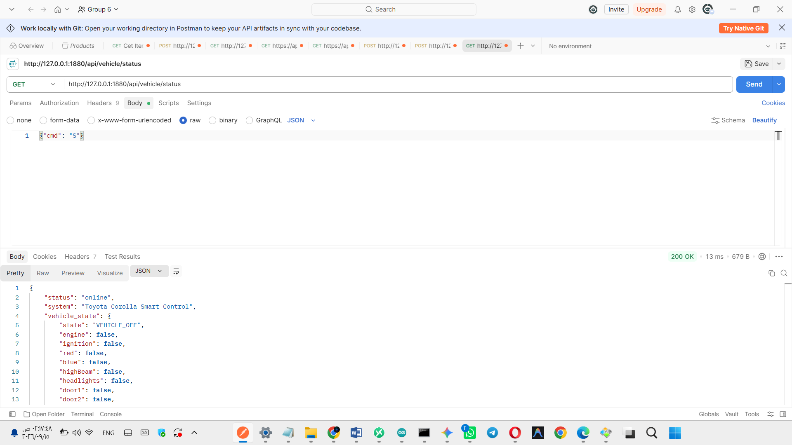
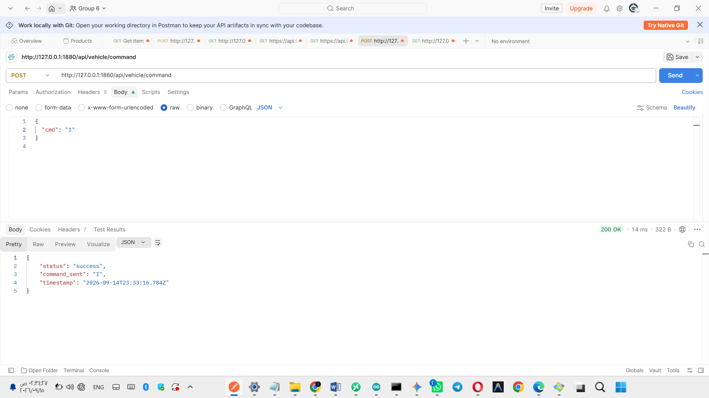
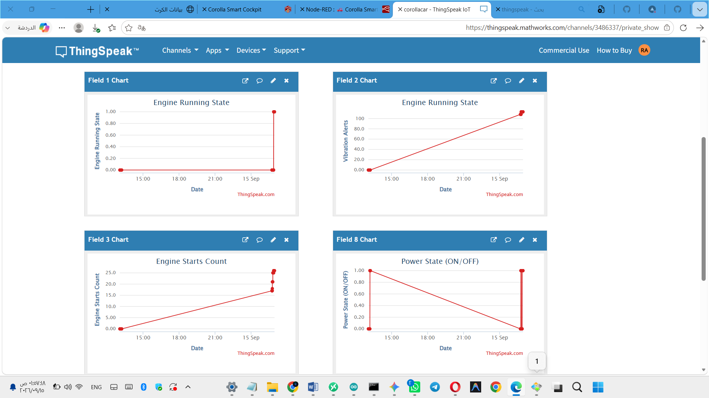
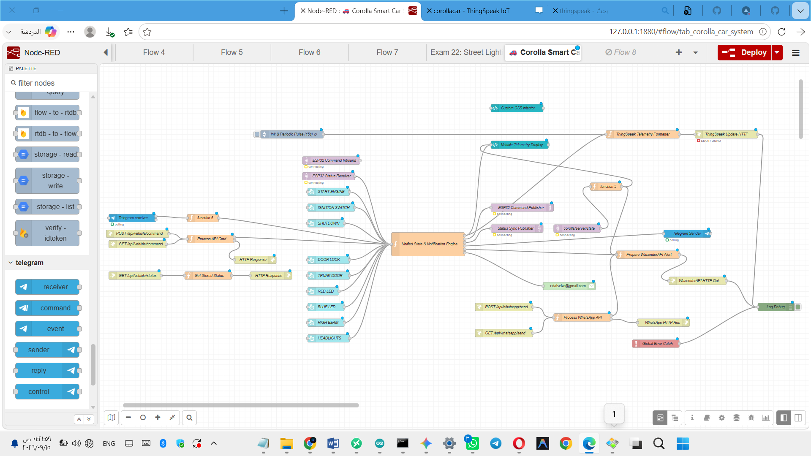

<div align="center"> # 🚗 Ultimate Smart Car Telemetry & Control System # نظام التحكم الذكي للسيارات والقيادة المدمجة عن بعد <p align="center"> <b> A Professional IoT Mobile & Desktop Control System Built for ESP32, Node-RED & Flutter </b> <br> <b>نظام إنترنت أشياء متطور للتحكم والقياس عن بعد بالسيارة عبر ESP32، MQTT، والذكاء الاصطناعي</b> </p> <!-- Shields Badges --> <p align="center">          </p> <p align="center"> <a href="https://github.com/rdalselwi"></a> <a href="https://www.linkedin.com/in/raad-al-selwi-23202a421"></a> <a href="https://t.me/r1h_x"></a> <a href="mailto:r.dalselwi@gmail.com"></a> </p> --- </div> ## 📱 واجهات النظام (System Dashboards & UI) <p align="center">  &nbsp;&nbsp;  &nbsp;&nbsp;  </p> <p align="center">  &nbsp;&nbsp;  </p> <p align="center">  &nbsp;&nbsp;  </p> <p align="center">  &nbsp;&nbsp;  </p> --- ## 📖 نبذة عن المشروع (About The Project) **Ultimate Smart Car Telemetry & Control System** منظومة إنترنت أشياء متكاملة للربط المباشر والتحكم الذكي بالمركبة (Toyota Corolla) عبر متحكم **ESP32**. يجمع النظام بين المراقبة اللحظية لبيانات التيليمتري (Real-time telemetry)، التحكم في المشغلات الميكانيكية والكهربائية، التحليل السحابي عبر **ThingSpeak**، والتكامل المزدوج مع منصات التواصل الفوري (**WhatsApp & Telegram**) لتنفيذ الأوامر واستقبال التنبيهات الحرجة. --- ## ✨ المميزات والخصائص الرئيسية (Key Features) * **بوابة الأمان والتحقق المتقدم:** حماية النظام عبر PIN Code أو المقاييس الحيوية مع واجهة دخول تفاعلية. * **لوحة العدادات الحية (Live Telemetry):** متابعة السرعة، معدل دوران المحرك (RPM)، درجة الحرارة، وحالة الوقود بتصميم Dark Glassmorphism. * **التحكم الشامل عن بعد:** تشغيل/إيقاف المحرك، التحكم بقفل الأبواب وصندوق الأمتعة، وإدارة الإضاءة الرئيسية والإضاءة المحيطية RGB. * **المساعد الذكي (AI Assistant):** تفاعل صوتي ونصوص حية لتشخيص الأعطال وتتبع حالة الأنظمة الداخلية. * **التحليل السحابي والبيانات التاريخية:** رفع وتسجيل قراءات التيليمتري مباشرة عبر منصة **ThingSpeak IoT Cloud** لإجراء التحليلات الزمنية. * **التحكم والإنذار عبر المراسلة الفورية:** ربط متزامن مع **WhatsApp Bot** و **Telegram Bot** لإرسال الأوامر النصية وتلقي تنبيهات الطوارئ والحماية فوراً. * **بيئة اختبار واجهات البرمجة:** توثيق واختبار كافة نقاط الاتصال والـ REST APIs عبر **Postman**. --- ## 🛠️ المكونات والتقنيات المستخدمة (Tech Stack & Architecture) * **المتحكم الدقيق (Microcontroller):** ESP32 NodeMCU / ESP32-WROOM مدمج باتصال Wi-Fi. * **بروتوكولات ووسطاء الرسائل (Messaging Brokers):** * **Eclipse Mosquitto:** خادم وسيط لإدارة وتوزيع رسائل MQTT المحلية والسحابية بأقل معدل تأخير (Ultra-low latency). * **HiveMQ / Cloud Broker:** لدعم الاتصال الاحتياطي ونقل الحزم اللحظية. * **المنصات السحابية والتحليلية:** **ThingSpeak IoT** لرسم وتخزين مؤشرات أداء المركبة وقراءات الحساسات. * **محرك المعالجة والمنطق (Middleware):** **Node-RED Dashboard 2.0** لبناء مسارات المعالجة، الربط بين البروتوكولات، وتوجيه الأحداث. * **واجهات الاختبار (API Testing):** استخدام **Postman** لتشخيص الـ HTTP Endpoints والتحقق من صحة حمولة الرسائل (Payloads). * **تطبيقات الواجهة والمستخدم:** * **Flutter Framework:** تطبيق متجاوب لكافة المنصات (Mobile & Desktop). * **Telegram & WhatsApp APIs:** واجهات تفاعلية للتحكم السريع وإرسال تقارير الأمان اللحظية. --- ## 📂 هيكلية ملفات المشروع (Project Directory Structure) ```text ├── android/ # إعدادات وبناء منصة Android ├── ios/ # إعدادات منصة iOS ├── web/ # ملفات دعم الويب ├── windows/ # ملفات بناء تطبيق سطح المكتب (Windows) ├── lib/ # الكود المصدري لتطبيق Flutter وتصاميم الشاشات ├── assets/ # الموارد والخطوط والصور المستخدمة في الواجهات ├── esp32/ # الشفرات البرمجية والبرمجيات الثابتة (.ino) لمتحكم ESP32 └── pubspec.yaml # حزم واعتماديات تطبيق Flutter 

👨‍💻 المطور وحسابات التواصل (Developer & Contact)

تم تطوير وهندسة هذه المنظومة بواسطة المهندس رعد فهد عبده قائد الصلوي (Raad Al-Selwi):

🐙 GitHub: @rdalselwi

💼 LinkedIn: Raad Al-Selwi

✈️ Telegram: @r1h_x

📧 Email: r.dalselwi@gmail.com

📄 حقوق النشر والترخيص (License & Copyright)

جميع الحقوق محفوظة © 2026 المهندس رعد فهد عبده قائد الصلوي (Raad Al-Selwi). All rights reserved © 2026 Raad Al-Selwi.

